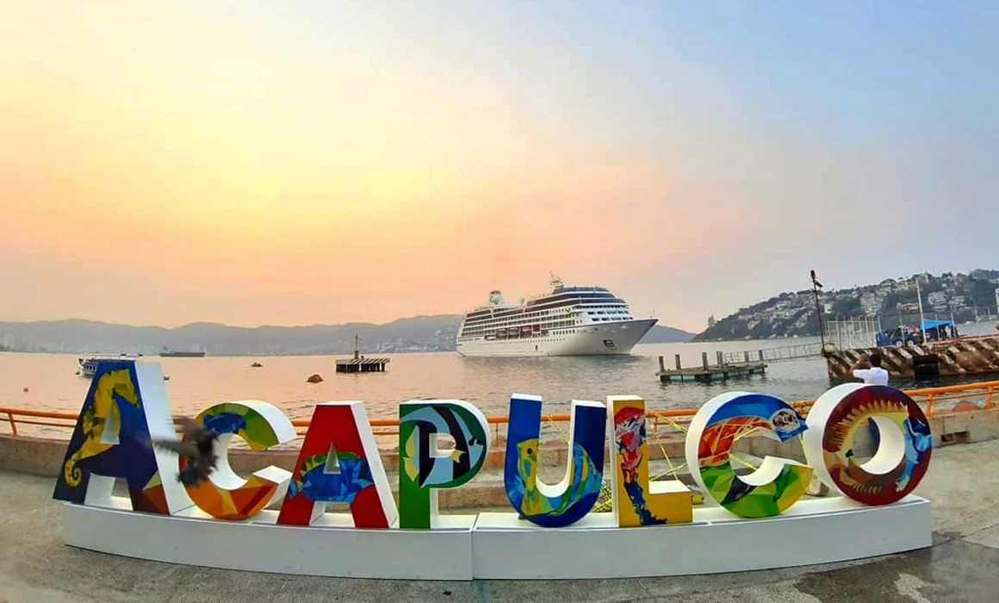
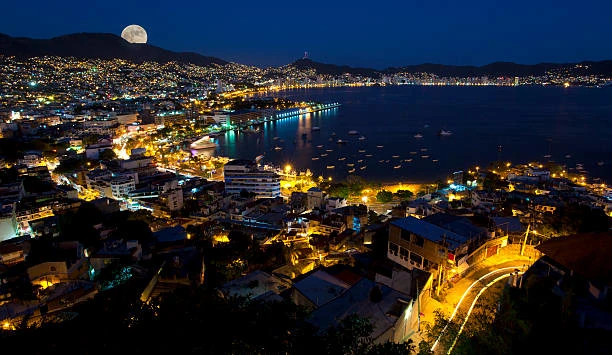

***
Acapulco
***

<h1 style="text-align:center;">Vacaciones en Acapulco</h1>

<h3>Acapulco, un balneario en la costa del Pacífico de México, se ubica en una gran bahía bordeado de edificios de muchos pisos y las montañas de la Sierra Madre del Sur. Se hizo famoso gracias al jet set en los años 1950 y 1960, y es conocido por su enérgica vida nocturna, las playas y el golf. Desde su icónico acantilado de La Quebrada, los clavadistas profesionales se lanzan desde 40 m para sumergirse en una pequeña caleta en el océano todos los días y noches. </h3>

1. Acapulco, un balneario
2. Costa del Pacífico de México
3. Famoso gracias al jet set en los años 1950 y 1960.
4. Icónico acantilado de La Quebrada, 
5. Los clavadistas profesionales se lanzan desde 40 m para sumergirse en una pequeña caleta. 

[Acapulco La Nuit](https://youtu.be/ntmcfEwXoKY)

<https://www.pinkfloyd.com/home>

[Pink Floyd actuará en Acapulco](https://youtu.be/84Tq-eAJIk4?list=RD84Tq-eAJIk4)
